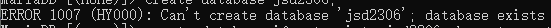

## MySQL

### 登录与登出

- **登录远端服务器** mysql -u(用户名) -h(ip地址) -P(端口号) -p(密码)
- **登陆本地服务器** mysql -u(用户名) -p(密码)
- **登出** exit *(ctrl+c)*

## SQL

> 编程语言

- SQL是Structured Query Language的缩写，翻译成中文为结构化查询语言
- SQL是与数据库进行交互的一种标准，但是不同数据库会有基于SQL的一些不同实现

### SQL的用处

- 创建数据库中的对象
- 访问数据库中的对象
- 更新数据库中的数据

### SQL类型

> 不同类型的SQL语法不同
> <p></p>
> 基于业务选择不同的SQL进行应用

- 数据定义语言，用于操作数据库对象 [数据库，表，视图，索引，...\]

#### DDL:数据操纵语言,用于操作(添加，修改，删除，查询)表中数据

#### DQL:数据查询语言,用于查询数据库中的数据

#### TCL:TCL（Tool Command Language）是一种脚本编程语言，在数据库中通常被用于编写存储过程和触发器。TCL提供了一系列的命令和语法，可以用于控制程序流程、执行数据库操作以及处理数据

## 数据库基本操作

### 创建数据库

```mysql
create database qwq character set = utf8;
#                  数据库的名字 编码方式
#     可小写
#     推荐大写
```

#### 案例演示

<p>创建一个名字为jsd2306的数据库</p>

```mysql
create database jsd2306;
```

数据库无法重复创建

<p>因此</p>



```mysql
create database if not exists jsd2306 character set utf8mb4;
```

<p></p>


### 删除数据库

```mysql
drop database if exists 数据库名字;
```

#### 案例演示

<p>删除名为jsd2306的数据库</p>

```mysql
drop database if exists jsd2306;
```

### 查看数据库

#### 查看所有数据库

```mysql
show databases;
```

### 查看帮助

<p>查询创建和删除数据库的语法</p>

```mysql
help 'create database';
# 或者:
# ? 'create database';
```

